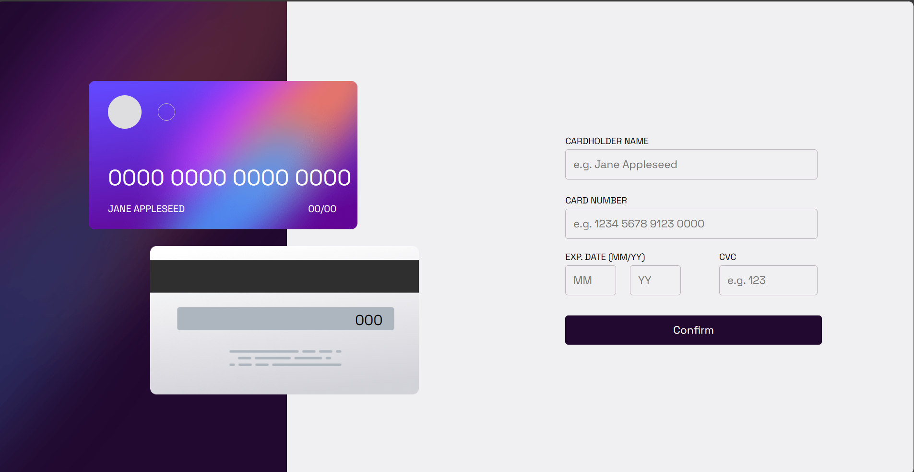
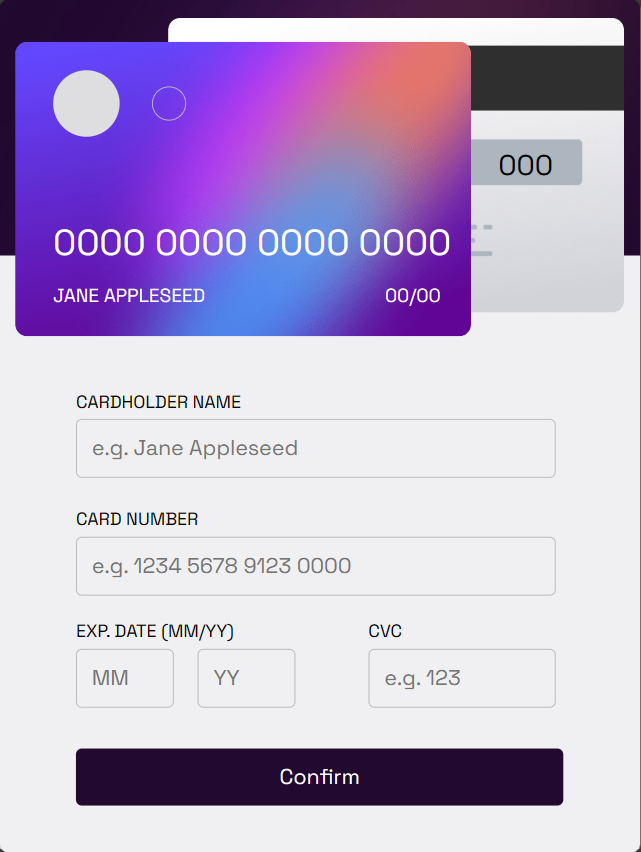
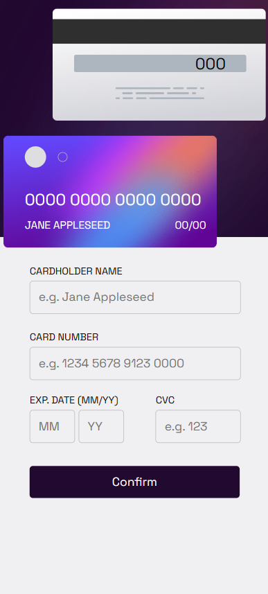

# Frontend Mentor - Interactive card details form solution

This is a solution to the [Interactive card details form challenge on Frontend Mentor](https://www.frontendmentor.io/challenges/interactive-card-details-form-XpS8cKZDWw). Frontend Mentor challenges help you improve your coding skills by building realistic projects. 

## Table of contents

- [Overview](#overview)
  - [The challenge](#the-challenge)
  - [Screenshot](#screenshot)
  - [Links](#links)
- [My process](#my-process)
  - [Built with](#built-with)
  - [What I learned](#what-i-learned)
  - [Continued development](#continued-development)
- [Author](#author)
- [Acknowledgments](#acknowledgments)

## Overview

### The challenge

Users should be able to:

- Fill in the form and see the card details update in real-time
- Receive error messages when the form is submitted if:
  - Any input field is empty
  - The card number, expiry date, or CVC fields are in the wrong format
- View the optimal layout depending on their device's screen size
- See hover, active, and focus states for interactive elements on the page

### Screenshot





### Links

- Solution URL: [Add solution URL here](https://your-solution-url.com)
- Live Site URL: (https://mbungai-francesco.github.io/Interactive_Card_Form/)

## My process

### Built with

- Semantic HTML5 markup
- CSS custom properties
- Flexbox

### What I learned

I had never used the Date() function before this project.
Plus having to make the card number display in groups of 4 in the input field was the haredest part

```js
const  formatCardNumber = (input) => {
  const cleanedInput = input.value.replace(/\D/g, "");
  const regex = /^(\d{4})(\d{4})(\d{4})(\d{4})$/;
  const formatted = cleanedInput.replace(regex, "$1 $2 $3 $4");
  return formatted;
}

const checkDate = (m,y) =>{
  console.log(typeof m)
  // var date = moment(`20${y}-0${m}`);
  // console.log(date)
  date = new Date(`20${y}-0${m}`)
  console.log(date)
  if (isNaN(date.getTime()) || date.getTime() < 0) return false
  else return true
}
```

### Continued development

I'll be coming back to improve on the date validation, to make in such a way that your card must be 6 months away from expiration date

## Author

- github - [Forche Mbungai Francesco](https://github.com/Mbungai-Francesco)
- Frontend Mentor - [@Mbungai-Francesco](https://www.frontendmentor.io/profile/Mbungai-Francesco)
- Twitter - [@MbungaiF](https://twitter.com/MbungaiF)
- Portfolio - [Portfolio](https://mbungai-francesco.github.io/Portfolio/)

## Acknowledgments

I thank God for the strength and resources he keeps sending my way.
